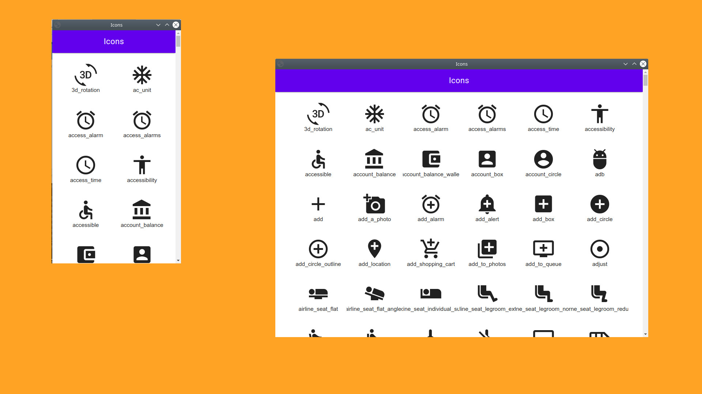

#  [](https://pkg.go.dev/qlova.org/seed) [](https://goreportcard.com/report/github.com/qlova/seed) [](https://travis-ci.org/qlova/seed)

The cross-platform Go module for building apps (pronounced klo-va-seed). 

## Usecases

*As a lightweight alternative to Electron*  
 Write your frontend and native code in Go, distribute native binaries of your app.
 Supported on Windows, Mac & Linux. Mobile support planned.
 
*Full-stack progressive webapp*  
 Write the complete app in Go, place binaries on public-facing web servers.
 Access these apps on Windows, Mac, Linux, IOS & Android.
 
*As a lightweight alternative to Phonegap* (WIP linux-only)  
 Write your app in Go, export the frontend as a native app.
 Android-only. IOS support planned.

[Examples](examples)



## Getting started

Create HelloWorld.go file and paste in the following contents:

```go
package main

import (
	"qlova.org/seed/new/app"
	"qlova.org/seed/new/text"
)

func main() {
	app.New("Hello World",
		text.Set("Hello World"),
	).Launch()
}
```

In the same folder, run 'go mod init .' to initialise the project and then 'go build' to create an executable for the app, run this to launch the app. By default, Qlovaseed will start a WebServer and open a browser window displaying your app.

## Core Concepts

Qlovaseed is a full-stack cross-platform application-development framework.  
This means that Apps created with Qlovaseed under the hood feature both a client and server component.  

Qlovaseed aims to blur the client-server distinction, the app is written as a whole, in Go.
Then communication is achieved with 'client' and 'clientside' packages.

Javascript and http.Handlers are managed by the framework.

This is a clientside pattern that changes the text of the button on the client-side.
```go
    var Text = new(clientside.String)

    button.New(
        text.SetTo(Text),

        client.OnClick(Text.Set("You Clicked me")),
    )
```

This is client handler that changes the text of the button from the server.
```go
	var Text = new(clientside.String)

    button.New(
        text.SetTo(Text),

        client.OnClick(client.Go(func() client.Script {
            return Text.Set("You Clicked me")
        }),
    )
```

Given an App, by default Qlovaseed will create a web server, manage the handlers, HTML, JS & CSS. All these resources are pre-rendered by Qlovaseed.
Then the app will be launched on the local web browser in kiosk mode (if available).  
Alternatively, the app can be placed on a remote server and proxied through a webserver with automatic HTTPS (such as [Caddy](https://caddyserver.com/)).  
This will serve the app as a Lighthouse-compliant progressive WebApp.

## Full App example.

```go
package main

import (
	"image/color"

	"qlova.org/seed/client"
	"qlova.org/seed/client/clientside"

	//Import a seed to use it, a list of seeds can be found [here](https://github.com/qlova/seed/tree/master/new).
	"qlova.org/seed/new/app"
	"qlova.org/seed/new/button"
	"qlova.org/seed/new/text"

	"qlova.org/seed/set"
)

func main() {
	var Text1 = &clientside.String{Value: "My callback runs on the client"}
	var Text2 = &clientside.String{Value: "My callback runs on the server"}

	app.New("My App",
		button.New(
			text.SetStringTo(Text1),

			client.OnClick(Text1.Set("You Clicked me")),
		),

		button.New(
			text.SetStringTo(Text2),

			set.Color(color.RGBA{100, 100, 0, 255}),

			client.OnClick(client.Go(func() client.Script {
				return Text2.Set("You Clicked me")
			})),
		),
	).Launch()
}
```

This example shows a quick glimpse on how powerful Qlovaseed is.

## Project folder structure

For larger apps, it is a good idea to seperate the ui from the business logic. The recomended folder structure is:

```
    domain (business logic)
    |
    ├───── main (main package that launches the app)
    |      └─── main.go
    |
    ├───── ui (pages & popups)
    |      ├─ new (place custom seed packages in here)
    |      |  └─── customseed
    |      |        └──────── customseed.go
    |      |
    |      ├─ user (global clientside state)
    |      |  └─── user.go
    |      |
    |      ├─ style (styles for your seeds)
    |      |  └─── styles.go
    |      |
    |      └─ page.Home.go
    |
    └───── domain.go
```

## Styles

All seeds can be styled with methods from the set package.

```
import "color"
import "qlova.org/seed/set"
import "qlova.org/seed/new/text"
import "qlova.org/seed/use/css/units/rem"

text.New(set.Color(color.RGBA{100, 0, 0, 255}),
    set.Margin(rem.One, rem.One),

    text.Set("Some stylable text"),
)
```

## HTML/CSS/JS

The use of raw HTML, CSS and Javascript to build apps is discouraged.
However, there may be good reasons to use these technologies to extend functionality or to create new seeds.

* Seeds have a html.Set option for setting raw HTML.
* When in doubt, css.Set can be used to set css styles with strings,
* js.Bundle is useful for embedding Javascript and CSS files. Checkout the gallery seed.

## Community 

There is a reddit community: [/r/Qlovaseed](https://www.reddit.com/r/Qlovaseed/).

Please don't hesitate to ask questions here. I haven't invested a lot of time into documentation yet.

**Please remember**, this framework is in development, it does not have a stable API and features are currently implemented as needed.

**License**  
This work is subject to the terms of the Qlova Public
License, Version 2.0. If a copy of the QPL was not distributed with this
work, You can obtain one at https://license.qlova.org/v2

The QPL is compatible with the AGPL which is why both licenses are provided within this repository.
